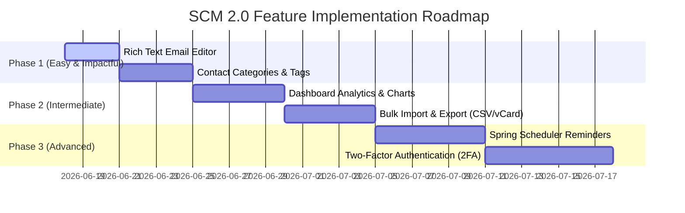
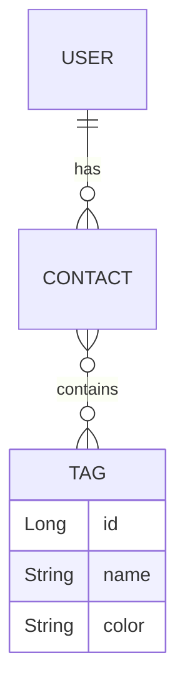

# 🚀 SCM 2.0 - Future Roadmap & Technical Implementations

This document serves as the roadmap and implementation guide for future premium enhancements to the **Smart Contact Manager (SCM 2.0)**. When you have time, we can pick any of these features and start building.

---

## 📅 Roadmap Overview



---

## 🎨 1. Rich Text Email Editor (Quill.js)
Integrate a modern WYSIWYG editor for composing direct emails instead of using standard plain text.

### Implementation Guide
1. **Thymeleaf Integration:** Add the Quill library CDN in `templates/user/direct_message.html`:
   ```html
   <!-- Include Quill stylesheet -->
   <link href="https://cdn.jsdelivr.net/npm/quill@2.0.2/dist/quill.snow.css" rel="stylesheet" />
   
   <!-- Theme container -->
   <div id="editor-container" class="h-64 bg-white dark:bg-gray-800 text-black dark:text-white"></div>
   <!-- Hidden input to bind with Spring Form -->
   <input type="hidden" id="body-input" th:field="*{body}" />
   
   <!-- Include Quill JS -->
   <script src="https://cdn.jsdelivr.net/npm/quill@2.0.2/dist/quill.js"></script>
   <script>
     const quill = new Quill('#editor-container', { theme: 'snow' });
     
     // Update hidden input on text change
     quill.on('text-change', function() {
       document.getElementById('body-input').value = quill.root.innerHTML;
     });
   </script>
   ```
2. **Backend Change:** In `EmailServiceImpl.java`, use HTML mime-type flags (`helper.setText(body, true)`) so the tags render as styled elements.

---

## 📊 2. Dashboard Analytics & Charts
Provide visualization of user statistics, such as contacts added over time and favorite distributions.

### Implementation Guide
1. **Maven Dependency:**
   No extra backend dependency needed; we can expose data using Spring Data queries.
2. **Controller Endpoint (`ApiController.java`):**
   ```java
   @GetMapping("/api/contacts-stats")
   public ResponseEntity<?> getStats(Authentication authentication) {
       String username = Helper.getEmailOfLoggedInUser(authentication);
       User user = userService.getUserByEmail(username);
       // Query db to count contacts grouped by created date or status
       Map<String, Object> stats = new HashMap<>();
       stats.put("total", user.getContacts().size());
       stats.put("favorites", user.getContacts().stream().filter(Contact::isFavorite).count());
       return ResponseEntity.ok(stats);
   }
   ```
3. **Frontend Script (`static/js/stats.js`):** Use **Chart.js** or **ApexCharts** to parse this JSON payload and render responsive pie/bar charts.

---

## 🏷️ 3. Contact Groups & Labels
Allow users to tag their contacts (e.g., *Family, Work, Important*) and filter by labels.

### Database Design

* **Steps:**
  1. Create a `Tag` entity.
  2. Map a `@ManyToMany` relationship inside `Contact.java` and `Tag.java`.
  3. Create standard CRUD endpoints for Tags, letting users choose custom hex colors.

---

## 📤 4. Bulk Import & Export (vCard / CSV)
Help users import contacts from google contacts/phones (via `.vcf` file) or bulk upload via Excel/CSV.

### Implementation Guide
1. **Maven Dependencies (`pom.xml`):**
   ```xml
   <!-- For vCard Parsing -->
   <dependency>
       <groupId>com.googlecode.ez-vcard</groupId>
       <artifactId>ez-vcard</artifactId>
       <version>0.12.1</version>
   </dependency>
   <!-- For CSV Parsing -->
   <dependency>
       <groupId>com.opencsv</groupId>
       <artifactId>opencsv</artifactId>
       <version>5.9</version>
   </dependency>
   ```
2. **Controller Handler:**
   ```java
   @PostMapping("/import")
   public String importContacts(@RequestParam("file") MultipartFile file, Authentication authentication) {
       // Parse vcard or CSV using FileReader and save items to DB
       return "redirect:/user/contacts";
   }
   ```

---

## ⏰ 5. Spring Scheduler for Reminders
Let users schedule follow-ups on contacts. SCM will send them a clean morning reminder email.

### Implementation Guide
1. **Enable Scheduling:** Add `@EnableScheduling` in `Application.java`.
2. **Task Scheduler Class:**
   ```java
   @Component
   public class ReminderTask {
       
       @Autowired
       private ContactRepo contactRepo;
       @Autowired
       private EmailService emailService;
       
       @Scheduled(cron = "0 0 9 * * ?") // Every day at 9:00 AM
       public void sendMorningReminders() {
           LocalDate today = LocalDate.now();
           // Find all tasks/contacts scheduled for today and send emails
       }
   }
   ```

---

## 🔐 6. Two-Factor Authentication (2FA)
Implement extra security during login via OTP generators.

### Implementation Guide
1. **Library (`pom.xml`):**
   ```xml
   <dependency>
       <groupId>org.jboss.aerogear</groupId>
       <artifactId>aerogear-otp-java</artifactId>
       <version>1.0.0</version>
   </dependency>
   ```
2. **Workflow:**
   * Generate a unique base32 secret key for the user.
   * Render a QR code containing `otpauth://totp/SCM:email?secret=KEY` using Google Charts API.
   * On login authentication success, check if 2FA is active. If active, redirect to a validation page prompting for the app's current 6-digit TOTP before issuing the full Spring Security Session.
