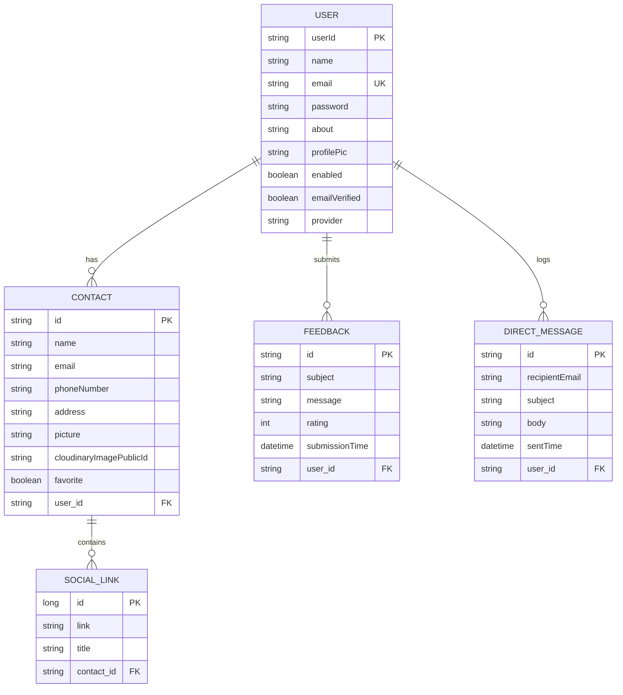

# 🎓 Smart Contact Manager (SCM 2.0) - Interview Preparation Guide

Yeh guide aapko **Smart Contact Manager (SCM 2.0)** project ke interview perspective se ready karegi. Isme **Kya use kiya**, **Kaise kiya**, **Kyu kiya**, aur **Kya-kya needs hui** ko detailed Hinglish aur professional English dono me cover kiya gaya hai, taaki aap easily interviewer ko impress kar sakein.

---

## 📌 Section 1: Project Overview (1-Minute Elevator Pitch)

### 🔹 Hinglish explanation:
Interviewer ko batane ke liye: "SCM 2.0 ek secure, cloud-enabled contact management application hai. Isme users apne contacts ko manage kar sakte hain, Google/GitHub se social login kar sakte hain, contacts ko direct emails bhej sakte hain (SMTP), contact details ko client-side se Excel format me export kar sakte hain, aur application feedback aur star ratings submit kar sakte hain. Ise maine Spring Boot, Hibernate, MySQL, Thymeleaf aur Tailwind CSS ke sath build kiya hai aur AWS Elastic Beanstalk par deploy kiya hai."

### 💼 Professional English Response:
> *"Smart Contact Manager (SCM 2.0) is a secure, cloud-integrated contact management system built on Spring Boot, Spring Security (OAuth2), Hibernate, and MySQL. It features a modern, responsive user interface styled with Tailwind CSS and Thymeleaf templates. The system allows users to perform full CRUD operations on contacts, upload contact avatars using the Cloudinary API, perform server-side pagination and dynamic searching, export directories to Excel instantly, and dispatch emails directly through custom SMTP integrations. Lastly, it is deployed on AWS Elastic Beanstalk using Nginx as a reverse proxy, connected to an Amazon RDS database."*

---

## 🛠️ Section 2: Technology Stack (Kya use kiya, Kyu kiya, Kaise kiya)

| Layer / Feature | Technology Used | Kyu Kiya? (Rationale) | Kaise Kiya? (Implementation Flow) |
| :--- | :--- | :--- | :--- |
| **Backend Framework** | **Spring Boot 3.2.5** | Ready-to-run environment, Dependency injection, embedded server, dynamic auto-configurations, ecosystem popularity. | Maven structure with starter packages. Main class bootstraps via `SpringApplication.run()`. |
| **Security Layer** | **Spring Security 6** | Industry standard, prevents SQL injection, Session hijacking, CSRF, and manages role-based access control easily. | Configured a `SecurityFilterChain` bean. Routes under `/user/**` are authenticated, others are public. Password hashing done via `BCryptPasswordEncoder`. |
| **Social Login** | **Spring OAuth2 Client** | Allows user authentication using Google & GitHub profiles directly, minimizing registration friction. | Configured client ID & secrets in `application-dev.properties`. Handled claims extraction in `OAuthAuthenicationSuccessHandler` to save users automatically. |
| **Database & ORM** | **MySQL + Spring Data JPA** | Structural persistence (relational data like Users-to-Contacts is best managed by SQL). JPA reduces boilerplate repository SQL. | Map classes with `@Entity`, `@OneToMany`, `@ManyToOne`. Repository interfaces extend `JpaRepository` supporting automatic query generation. |
| **UI Templates** | **Thymeleaf 3 + Tailwind CSS** | Server-side template engine that binds data seamlessly. Tailwind allows rapid UI styling without heavy CSS sheets. | Created a `base.html` layouts file. Component fragments (navbar, sidebar) are loaded dynamically. Tailwind compiler packages styles in `output.css`. |
| **Image Hosting** | **Cloudinary API** | Storing files locally on application server causes issues on cloud redeployment. Cloudinary offers free, highly optimized CDN hosting. | Controller parses image input as `MultipartFile`. It sends byte streams to Cloudinary SDK uploaders, returning a public CDN URL. |
| **Direct Mailing** | **Spring Boot Mail (SMTP)** | Enables sending direct updates, verification links, or customized mailers directly from the dashboard. | Used `JavaMailSender` over SMTP (Gmail port 587). Handled SMTP restrictions by separating authenticated username and Reply-To header. |
| **Export to Excel** | **TableToExcel JS Library** | Offloads file generation from server memory to client browser. Fast, responsive, 0 backend CPU load. | Integrated via CDN. JavaScript extracts target HTML table structure (`#contact-table`) and parses it directly to `.xlsx`. |

---

## 🏗️ Section 3: Database Schema & Entity Relationships

Database me entities aur relationships kaise configured hain:

### Key Relationships explained:
1. **User ➔ Contact (`@OneToMany` with LAZY fetch):** Ek user ke multiple contacts ho sakte hain. Accessing contacts is lazy so that fetching a user profile doesn't query all their contacts unless explicitly requested.
2. **Contact ➔ User (`@ManyToOne` with `@JsonIgnore`):** Multiple contacts map to a single user. `@JsonIgnore` is used to prevent infinite recursion during JSON serialization.
3. **User ➔ Feedback (`@OneToMany` with LAZY fetch):** Users submit feedback and rating logs.
4. **User ➔ DirectMessage (`@OneToMany` with LAZY fetch):** Tracks email dispatch outbox history for audit trails.

---

## 🚀 Section 4: Key Feature Deep-Dives

### 1. OAuth2 Login & Registration Flow
*   **The Problem:** Normal logins require passwords. Social logins are preferred by users.
*   **The How:** In `SecurityConfig.java`, we enabled `oauth2Login()`. When a user logins through Google, the request goes to Google. On success, Spring security redirects to our custom `OAuthAuthenicationSuccessHandler.java`.
*   **Success Handler Logic:**
    *   Determines registration ID (`google` or `github`).
    *   Extracts fields (Google: `email`, `picture`, `name`; GitHub: `login`, `avatar_url`).
    *   Checks if the email already exists in our MySQL database.
    *   If not, it programmatically registers a new user with provider tag (`GOOGLE` or `GITHUB`).
    *   Finally, redirect to `/user/profile`.

### 2. Image Uploading via Cloudinary SDK
*   **The Problem:** Storing image files directly on the server's hard drive is risky because:
    1. Redeploying the app (like on AWS Elastic Beanstalk) clears the local disk, deleting all uploaded files.
    2. Scaling across multiple servers means other servers won't have access to local file directories.
*   **The How:** In `ImageServiceImpl.java`, the image is received as a `MultipartFile`. We read its bytes and call:
    `cloudinary.uploader().upload(data, ObjectUtils.asMap("public_id", filename));`
    It stores the image in Cloudinary's cloud. We also apply dynamic crop and resizing transformations (`width(150)`, `height(150)`, `crop("fill")`) before saving the URL to the contact's record, ensuring consistent layout and fast rendering.

### 3. Server-Side Pagination & Null-Safe Searching
*   **The Problem:** Querying thousands of records at once creates slow databases and high JVM memory usage.
*   **The How:** We implement Spring Data's `Pageable` interface.
    *   URL parameters: `/user/contacts?page=0&size=10&sortBy=name&direction=asc`
    *   Our controller fetches: `Page<Contact> pageContact = contactService.getByUser(user, page, size, sortBy, direction);`
    *   Thymeleaf dynamically renders the pagination bar based on `pageContact.getTotalPages()` and `pageContact.getNumber()`.
    *   **Null-Safe Searching:** If the user submits an empty search field, the search query defaults gracefully to dynamic name matching in `ContactController.java` to prevent Thymeleaf rendering engine crashes.

### 4. Custom Star-Rating & Feedback Desk
*   **The How:**
    *   **Frontend UI:** Star rating container has 5 buttons (`data-val` 1 to 5).
    *   **JavaScript:** Listens to clicks on stars, updates the rating value of a hidden form input (`id="rating-input"`), and updates CSS classes (changing color to `text-amber-400`).
    *   **Backend Validation:** On form submission, `@Valid @ModelAttribute FeedbackForm` checks if parameters meet constraints (`@Min(1) @Max(5)`).
    *   **Thymeleaf Rendering:** Displays stars dynamically in history logs using `#numbers.sequence(1, 5)` to output full stars `★` vs empty stars `☆`.

---

## 📈 Section 5: AWS Deployment Architecture

### How the Cloud Deployment is set up:
1.  **Platform:** AWS Elastic Beanstalk (Java SE platform with Amazon Corretto 21).
2.  **Reverse Proxy:** Beanstalk automatically spins up an **Nginx** server, which routes external port 80/443 traffic to port 5000 inside the container.
3.  **Spring Port Mapping:** Spring Boot listens on port 5000 using `SERVER_PORT=5000` via the environment variables and a custom `Procfile` containing:
    `web: java -jar scm2.0.jar`
4.  **External Database:** Connected to **Amazon RDS MySQL** (Relational Database Service). Hardcoding database passwords inside the code is prevented by using environment variable placeholders:
    `spring.datasource.url=jdbc:mysql://${MYSQL_HOST}:${MYSQL_PORT}/${MYSQL_DB}?createDatabaseIfNotExist=true`
5.  **Build Automation:** Built with `./mvnw clean package`, packaged into a zip file along with the `Procfile`, and uploaded directly to Elastic Beanstalk.

---

## ❓ Section 6: Top 20 Technical Interview Questions & Answers

### Q1: What is Spring Boot and how is it different from standard Spring Framework?
> **Answer:** Spring Framework requires manual XML or Java configurations, configuring servers (like Tomcat), and manually adding dependencies. Spring Boot offers **Starter dependencies** (which bundle library configurations), **Auto-configuration** (which configures beans automatically based on class-path libraries), and an **Embedded Tomcat server**, allowing us to create production-ready applications with minimal configuration.

### Q2: Explain the security filter chain implementation in your `SecurityConfig.java`.
> **Answer:** We configure a `SecurityFilterChain` bean. We use it to secure endpoints by calling `authorizeHttpRequests`. Specifically, we protect `/user/**` routes (requiring authentication) and allow public access to all other endpoints. It also hooks up our custom login pages, login processing routes (`/authenticate`), custom authentication failure handler, logout handlers, and configures OAuth2 single sign-on.

### Q3: Why did you disable CSRF (Cross-Site Request Forgery) in your configuration?
> **Answer (Honest & Secure):**
> *In development, we disabled CSRF using `httpSecurity.csrf(AbstractHttpConfigurer::disable)` to simplify integration testing of POST forms without having to manually inject CSRF tokens in every REST request. However, in a real production environment, for standard Thymeleaf-submitted forms, CSRF should remain enabled to prevent cross-site request attacks. Thymeleaf automatically embeds a hidden token field in forms when using `th:action`.*

### Q4: How does OAuth2 authentication flow work from start to finish when a user clicks "Login with Google"?
> **Answer:**
> 1. User clicks the Google login button linked to `/oauth2/authorization/google`.
> 2. Spring Security redirects the user's browser to the Google OAuth Authorization endpoint.
> 3. User logs in, approves permissions, and Google redirects back to our callback URL (`/login/oauth2/code/google`) with an authorization code.
> 4. Spring Security intercepts the code, exchanges it with Google for an Access Token, and retrieves the user profile claims.
> 5. Control passes to our custom `OAuthAuthenicationSuccessHandler`. Here, we extract client attributes, query our database to see if the email exists, register them if they are new, and log them into our security context session before redirecting them to `/user/profile`.

### Q5: How do you handle image uploads in SCM 2.0? Why not save them on the server disk?
> **Answer:** We handle uploads via the **Cloudinary SDK**. Multipart file data is parsed inside the controller and uploaded to Cloudinary's CDN. We don't save uploads on the server disk because cloud environments are **ephemeral** (autoscaling instances are replaced frequently, destroying local files). Centralized cloud storage ensures uploads remain persistent and fast regardless of server states.

### Q6: How does Spring Data JPA perform pagination and sorting?
> **Answer:** We pass a `Pageable` object (created using `PageRequest.of(page, size, Sort.by(sortBy).ascending/descending())`) directly into our repository interface method. Spring Data JPA automatically parses this request to insert `LIMIT`, `OFFSET`, and `ORDER BY` syntax into the SQL queries executed on the database, returning a `Page<T>` wrapper object containing the subset of data along with metadata like total pages.

### Q7: Explain the relationship between User and Contact entities. How does cascading work here?
> **Answer:** It is a `@OneToMany` relationship mapped by `User` and `@ManyToOne` mapped by `Contact`. We defined `cascade = CascadeType.ALL` and `orphanRemoval = true` in the User class. This means if a User is deleted, all their associated Contacts are deleted automatically from the database. Also, if a contact is removed from the user's collection, JPA automatically deletes that contact record.

### Q8: What is the purpose of `CommandLineRunner` in your `Application.java` class?
> **Answer:** `CommandLineRunner` is an interface used to execute a block of code exactly once when the Spring Boot application context completes initialization. In our app, we use it to execute raw SQL queries to ensure `users` columns are nullable, and to insert a default administrator account (`admin@gmail.com`) automatically on start.

### Q9: How do you send emails in this application? What configurations were required?
> **Answer:** We use Spring Boot Starter Mail which injects `JavaMailSender`. Configurations inside `application-dev.properties` include setting the host (`smtp.gmail.com`), port (`587`), TLS authentication flags, and app password. In `EmailServiceImpl.java`, we build a `MimeMessage` using `MimeMessageHelper` to support structured headers like Reply-To.

### Q10: How did you implement client-side Excel exporting? Why client-side instead of backend?
> **Answer:** We integrated the `@linways/table-to-excel` JS library via a CDN script tag. A click listener triggers `TableToExcel.convert(document.getElementById("contact-table"), { name: "contacts.xlsx" })`. Doing this on the client side reduces backend CPU load, eliminates the need to compile complex Java libraries like Apache POI, and downloads the file instantly.

### Q11: What is the difference between Lazy and Eager fetching strategies? Which one did you use?
> **Answer:**
> *   **Eager Fetching (`FetchType.EAGER`):** Queries and loads child entities from the database immediately alongside the parent.
> *   **Lazy Fetching (`FetchType.LAZY`):** Queries child records only when we call the child getter method (e.g., `user.getContacts()`).
> *We used Lazy fetching for User-to-Contacts to keep performance optimal, as fetching a user profile shouldn't load their entire contact catalog immediately. However, for Contact-to-SocialLinks, we used Eager loading as social links are small in size and always rendered together.*

### Q12: How are form errors validated and displayed back to the user?
> **Answer:** We use JSR-380 validation annotations on our form beans (like `@NotBlank`, `@Email`, `@Size` on fields inside `ContactForm`). In controllers, we mark parameters with `@Valid` and capture the result in a `BindingResult` object. If `result.hasErrors()` is true, we return the user back to the form page where Thymeleaf directives like `th:if="${#fields.hasErrors('fieldName')}"` render individual field error labels.

### Q13: What does the parameter `createDatabaseIfNotExist=true` do in the JDBC connection URL?
> **Answer:** It instructs the MySQL JDBC driver to automatically check if the target database name (e.g. `scm20`) exists on the host. If not, it executes a `CREATE DATABASE` statement under the hood before establishing the connection pool. This is useful for deployment setups (like Amazon RDS) because the database schema is auto-created on the first application startup.

### Q14: How did you handle null values during a Contact Search?
> **Answer:** In `ContactController.java`, if a search request is received with an empty search field category, the controller safely defaults to searching by "name". This check prevents sending null queries to our repository, which would otherwise result in database execution errors or Thymeleaf template evaluation crashes.

### Q15: What is Lombok? How does it save development time?
> **Answer:** Lombok is an annotation-based Java library that generates boilerplate code like getters, setters, constructors, builders (`@Builder`), and toString methods during build compilation. In our entities, annotating them with `@Getter`, `@Setter`, `@NoArgsConstructor`, and `@AllArgsConstructor` keeps our codebase concise and clean.

### Q16: How did you manage database connection credentials safely during cloud deployments?
> **Answer:** We used Spring's environment variable placeholder syntax: `${VAR_NAME:default_value}` in `application.properties`. During deployment on AWS Elastic Beanstalk, we set environment properties like `MYSQL_HOST` and `MYSQL_PASSWORD` via the AWS Web Console. Spring Boot reads these values during startup, overriding default local properties, keeping passwords out of public Git repositories.

### Q17: What is Spring Actuator?
> **Answer:** Actuator is a sub-project of Spring Boot that provides built-in HTTP endpoints (like `/actuator/health`, `/actuator/info`, or `/actuator/metrics`) to monitor and manage our application's health, database connection status, and running configurations in production.

### Q18: What is the purpose of `git_push.bat` script?
> **Answer:** It is a custom Windows Command Script designed to automate the developer workflow. Running it shows the current `git status`, prompts the developer to type a commit message, stages all modified and new files (`git add .`), commits them, and pushes directly to the remote repository. This prevents manual errors and speeds up the release cycle.

### Q19: How would you debug a "Field doesn't have a default value" error on inserts?
> **Answer:** This error occurs when a MySQL table column is set to `NOT NULL` but the Java entity mapping doesn't supply a value during insert. We troubleshoot this by:
> 1. Checking the database schema constraints.
> 2. Altering the columns to be nullable (as we did for `name` and `role` columns in `Application.java` using `JdbcTemplate`).
> 3. Ensuring values are initialized programmatically before calling `.save()`.

### Q20: If SCM 2.0 scales to 1 Million active users, how will you modify the architecture?
> **Answer (System Design scalability):**
> 1.  **Frontend/Backend Decoupling:** Convert this monolithic MVC app into a REST API and use a React/Next.js frontend hosted on static servers (like Vercel/S3) to offload page rendering.
> 2.  **Database Scaling:** Implement read-replicas for Amazon RDS MySQL (directing read searches to replicas and writes to master) and introduce Redis caching for frequently retrieved user profile data.
> 3.  **Load Balancing:** Run stateless Spring Boot API containers on AWS ECS (Elastic Container Service) behind an ALB (Application Load Balancer) configured with auto-scaling groups.
