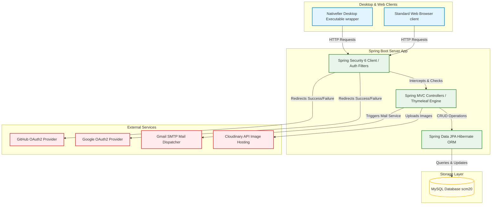
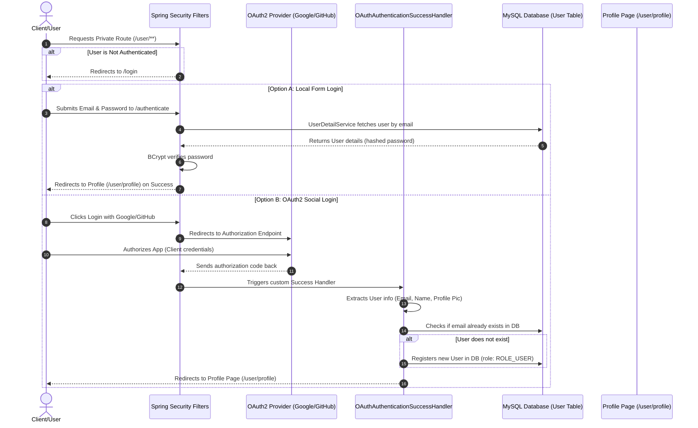
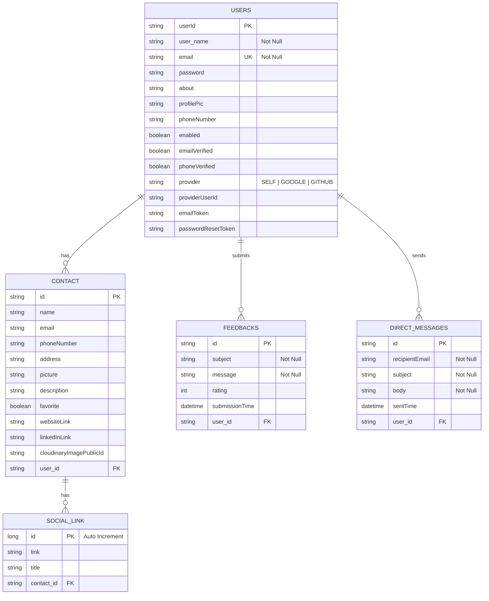

# Smart Contact Manager (SCM 2.0) - Architecture Guide

This document provides a comprehensive overview of the system architecture, component relationships, database schema, and security workflows of the **Smart Contact Manager (SCM 2.0)** application. 

Additionally, because you have **Excalidraw** installed, we have formatted the architectural diagrams using **Mermaid**. Excalidraw has native support for Mermaid, meaning you can easily import these diagrams directly into your Excalidraw canvas as editable elements.

---

## 🎨 How to Import Diagrams into Excalidraw

To load any of the diagrams below into your **Excalidraw** canvas:
1. Copy the raw code from any of the `mermaid` code blocks below.
2. Open **Excalidraw** (App or web at [excalidraw.com](https://excalidraw.com)).
3. Click on the **More tools** icon (the three dots/lines in the toolbar) or search for **Mermaid-to-chart**.
4. Paste the copied Mermaid code into the input box.
5. Click **Render** or **Insert**.
6. Excalidraw will immediately generate a fully-editable, styled flowchart/canvas from the code!

---

## 🏛️ 1. High-Level System Architecture

This diagram illustrates the relationship between the client wrapper (Web/Desktop), the backend Spring Boot Server, the MySQL Database, and the external integrations (Cloudinary, Gmail SMTP, and OAuth2 Providers).

---

## 📂 2. Layered Software Architecture (MVC & Clean Directory Layout)

The backend follows a classic **MVC (Model-View-Controller)** pattern with standard layers:
- **Presentation (Views):** Thymeleaf templates dynamically rendered with Tailwind CSS styling.
- **Controller Layer:** Web request mappings, form validations, and routing.
- **Service Layer:** Core business logic, transaction handling, image uploads, and email handling.
- **Data Access (Repository):** Database operations powered by Spring Data JPA interfaces.
- **Entities:** JPA mapping classes representing the relational database tables.

```mermaid
graph TD
    classDef layer fill:#F3E5F5,stroke:#7B1FA2,stroke-width:2px;
    classDef file fill:#ECEFF1,stroke:#37474F,stroke-width:1px;

    subgraph Presentation_Layer [Presentation Layer Thymeleaf]
        Views[HTML Templates & Tailwind CSS]:::layer
    end

    subgraph Controller_Layer [Controller Layer com.scm.controllers]
        PageController[PageController.java]:::file
        UserController[UserController.java]:::file
        ContactController[ContactController.java]:::file
        DMController[DirectMessageController.java]:::file
        FeedbackController[FeedbackController.java]:::file
        ApiController[ApiController.java]:::file
    end

    subgraph Service_Layer [Service Layer com.scm.services]
        UserService[UserServiceImpl.java]:::file
        ContactService[ContactServiceImpl.java]:::file
        EmailService[EmailServiceImpl.java]:::file
        ImageService[ImageServiceImpl.java]:::file
        FeedbackService[FeedbackServiceImpl.java]:::file
    end

    subgraph Repository_Layer [Repository Layer com.scm.repsitories]
        UserRepo[UserRepo.java]:::file
        ContactRepo[ContactRepo.java]:::file
        FeedbackRepo[FeedbackRepo.java]:::file
        DMRepo[DirectMessageRepo.java]:::file
    end

    subgraph Database_Layer [Database Entities com.scm.entities]
        UserEntity[User.java]:::file
        ContactEntity[Contact.java]:::file
        FeedbackEntity[Feedback.java]:::file
        DMEntity[DirectMessage.java]:::file
        SocialEntity[SocialLink.java]:::file
    end

    Views <-->|Submits Forms / Renders Data| Controller_Layer
    Controller_Layer -->|Calls Services| Service_Layer
    Service_Layer -->|Executes DB Queries| Repository_Layer
    Repository_Layer <-->|Maps Records to| Database_Layer
```

---

## 🔐 3. Security & Authentication Flow

This diagram describes the authentication interceptor flow implemented via **Spring Security 6** in [SecurityConfig.java](file:///c:/Users/Pavan%20Soni/Downloads/scm2.0-main_Final/scm2.0-main/src/main/java/com/scm/config/SecurityConfig.java). It supports custom handling for regular login and OAuth2 login successes.

---

## 📊 4. Database Entity-Relationship Diagram (ERD)

This is the conceptual database model mapping out our database schema:
- **Users Table (`users`):** Stores credentials, roles, email verification status, and SSO provider details. One User can have multiple contacts, feedbacks, and messages.
- **Contacts Table (`contact`):** Holds names, phone numbers, addresses, Cloudinary public image links, and references the owner User.
- **Social Links Table (`social_link`):** Holds specific web links associated with a Contact.
- **Feedbacks Table (`feedbacks`):** Stores user reviews/ratings linked back to the User.
- **Direct Messages Table (`direct_messages`):** Outbox logs of messages dispatched by Users.

---

## 🛠️ Summary of Important Files & Packages

1. **`com.scm.config`**:
   - [SecurityConfig.java](file:///c:/Users/Pavan%20Soni/Downloads/scm2.0-main_Final/scm2.0-main/src/main/java/com/scm/config/SecurityConfig.java): Configures secure endpoints (`/user/**`), custom login processing, OAuth2 login integration, and logout callbacks.
   - [OAuthAuthenicationSuccessHandler.java](file:///c:/Users/Pavan%20Soni/Downloads/scm2.0-main_Final/scm2.0-main/src/main/java/com/scm/config/OAuthAuthenicationSuccessHandler.java): Extracts OAuth attributes for Google and GitHub, registers new accounts on successful login, and redirects to user dashboards.
2. **`com.scm.controllers`**:
   - [PageController.java](file:///c:/Users/Pavan%20Soni/Downloads/scm2.0-main_Final/scm2.0-main/src/main/java/com/scm/controllers/PageController.java): Routes for landing, register, services, and contacts search pages.
   - [ContactController.java](file:///c:/Users/Pavan%20Soni/Downloads/scm2.0-main_Final/scm2.0-main/src/main/java/com/scm/controllers/ContactController.java): Manages CRUD flow of contacts, spreadsheet generation, and custom file uploads.
   - [UserController.java](file:///c:/Users/Pavan%20Soni/Downloads/scm2.0-main_Final/scm2.0-main/src/main/java/com/scm/controllers/UserController.java): Manages user dashboard, profile configurations, and statistics.
   - [DirectMessageController.java](file:///c:/Users/Pavan%20Soni/Downloads/scm2.0-main_Final/scm2.0-main/src/main/java/com/scm/controllers/DirectMessageController.java) & [FeedbackController.java](file:///c:/Users/Pavan%20Soni/Downloads/scm2.0-main_Final/scm2.0-main/src/main/java/com/scm/controllers/FeedbackController.java): Dispatches mail logs and gathers user feedbacks.
3. **`com.scm.services.impl`**:
   - Contains business execution layers like mail transport using `JavaMailSender`, custom file uploads using Cloudinary SDK, and entity management hooks.
4. **`src/main/resources/templates`**:
   - Thymeleaf templates grouped into layout templates (`user`, `admin`, default pages) integrated with Tailwind CSS styles.
